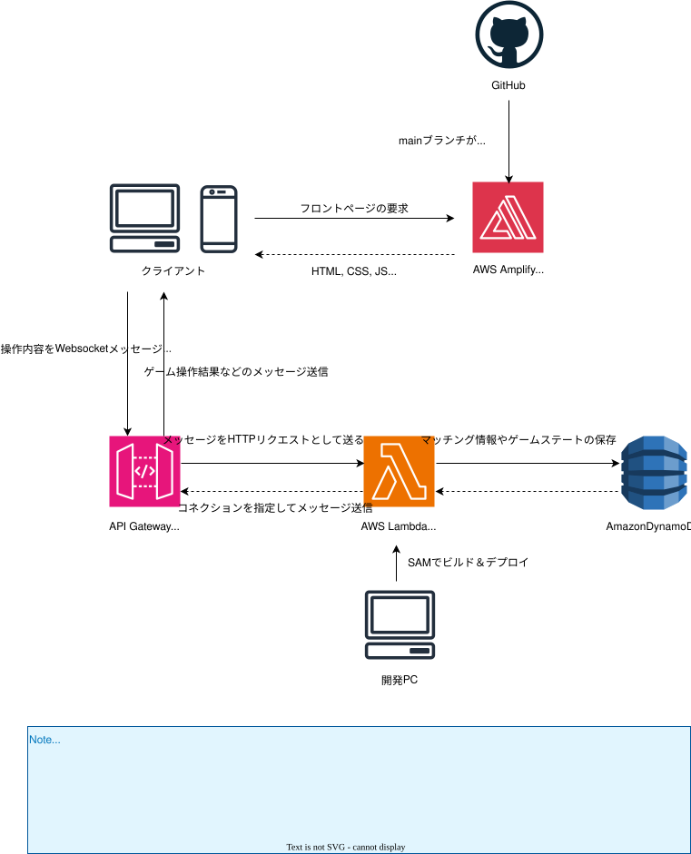

# TriggerGameCompose

## システム構成

本番環境のシステム構成図は以下を参照してください



## Docker Composeを利用したローカル実行

プロジェクトの実行にはDocker composeを利用します。

Docker Composeさえあればローカル実行できる状態を維持しておきたいです。
もしうまく行かなければご連絡お願いします。

```bash
# Dockerコンテナの起動
docker compose up --build
```

上記の起動コマンド実行後、ブラウザで `http://localhost:3000` にアクセスすることで、Next.jsアプリケーションが表示されます。

ChromeとEdgeや、一般タブとシークレットタブなど複数のブラウザでアクセスすることで、対戦機能の確認ができます。
(同じプロファイルだとセッションが共有されてしまうため、別のプロファイルやシークレットモードでアクセスしてください。)

止めるときは以下のコマンドを使用してください

```bash
# Dockerコンテナの停止
docker compose down
```

## プロジェクト構成

### ディレクトリ構成

本リポジトリの主要ディレクトリは以下です。

```text
TriggerGameCompose/
├── docs/                  # 仕様・設計・実装メモなどのドキュメント
├── game-client/                 # フロントエンド (Next.js + Phaser)
├── game_server/                 # バックエンド (Rust + AWS SAM)
├── local-dynamodb-initialize/   # ローカル DynamoDB 初期化ツール (Go)
├── local-websocket-apigateway/  # ローカル WebSocket API Gateway 代替 (Go)
├── docker-compose.yml           # ローカル起動用 Compose 定義
├── CONTRIBUTING.md              # コントリビュートルール
└── README.md                    # プロジェクトの入口ドキュメント
```

DynamoDBのローカル版はdocker compose内で `amazon/dynamodb-local:latest` のイメージを使用しています。
データベースの初期化の目的で `local-dynamodb-initialize` をdocker composeで動かしています。

なんでローカル用のツールをGo言語で作っているかというと、
会社ではRust使わないので、、使う可能性のあるGoの勉強のためです。。

## その他重要事項

### 開発ルール

- コントリビュート規約: [CONTRIBUTING.md](./CONTRIBUTING.md)

### 開発環境構築

開発環境構築手順は以下のドキュメントを参照してください。

[開発環境構築手順書](./docs/99_その他/環境構築/開発環境構築手順書.md)

### 本番環境

[本番環境ページリンク](https://main.dsxdacl6jlb8y.amplifyapp.com/)

### ゲームの基本的なルール・設計

[ドメインモデリング](./docs/02_基本設計/ドメイン駆動設計/01_ドメインモデリング/ドメインモデリング.md)

### スプリント振り返り・目標設定動画

[スプリント振り返り・目標設定動画](https://www.youtube.com/@pandapan_cute)

### 連絡先

[開発者のXアカウント](https://x.com/pandapan_cute)
