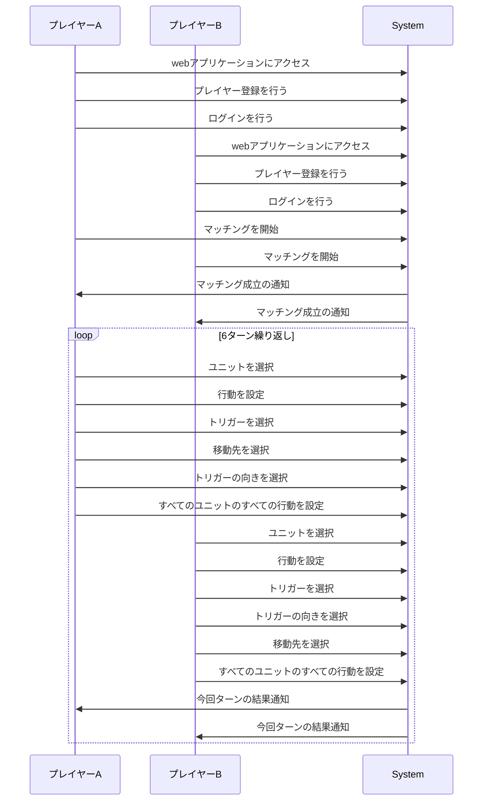

# イベントストーミング

## 参考

[イベントストーミング](https://zenn.dev/yamachan0625/books/ddd-hands-on/viewer/chapter5_event_storming)

イベントストーミング (Event Storming) とは、複雑なビジネスプロセスやドメインの知識を共有、可視化、そして理解するための協同作業ベースのモデリング手法です。

## ドメインイベントの洗い出し

### プレイヤー認証関連

* プレイヤーがwebアプリケーションにアクセスした
* アクセストークンによってログインした
* プレイヤーがプレイヤー登録を行った
* プレイヤーがログインを行った
* プレイヤーがプレイヤー情報の削除を行った
* プレイヤーがログアウトを行った

### マッチング関連

* 一人目のプレイヤーがマッチングを開始した
* 二人目のプレイヤーがマッチングを開始した
* プレイヤー同士がマッチングした
* プレイヤーがマッチングをキャンセルした

### 行動設定関連

* プレイヤーがユニットを選択した
* プレイヤーが行動(移動)を設定した
* プレイヤーが移動先を選択した
* プレイヤーがトリガーを選択した
* プレイヤーがトリガーの向きを選択した
* プレイヤーが行動(追跡移動)を設定した
* プレイヤーが追跡対象のユニットを選択した
* ユニットのすべての行動を設定した
* プレイヤーAがすべてのユニットのすべての行動を設定した
* その後、プレイヤーBがすべてのユニットのすべての行動を設定した
* 行動設定が完了する前に150秒経過した
* 6ターンが経過した

## ドメインイベント同士を時系列で繋げる

## ドメインイベント同士のギャップを埋める

### コマンド

#### プレイヤー認証関連

* プレイヤーがwebアプリケーションにアクセスする
* プレイヤーがプレイヤー登録を行う
* プレイヤーがログインを行う

#### マッチング関連

* プレイヤーがマッチングを開始する
* プレイヤーがマッチングをキャンセルする

#### 行動設定関連

* プレイヤーがユニットを選択する
* プレイヤーが行動を設定する
* プレイヤーがトリガーを選択する
* プレイヤーが移動先を選択する
* プレイヤーがトリガーの向きを選択する
* プレイヤーが対戦をキャンセルする

### ポリシー

* プレイヤー同士がマッチングしたら自動でゲームの初期化を開始する
    * マップを表示する
    * ユニットを配置する
    * ターンを1に設定する
    * 初期状態の視界をマップに反映する

* プレイヤーAが対戦をキャンセルしたら対戦を終了する
    * プレイヤーBに対戦キャンセルの通知を送る

* 両者のすべてのユニットの動きの設定が完了したらユニットの行動結果を計算する
* ユニットの行動結果の計算が完了したらそれぞれのプレイヤーに向けた内容の結果を通知する
* 動きの設定中に150秒が経過したら強制的に動きの設定を終了しユニットの行動結果を計算する
* 6ターンが経過したら対戦を終了する
