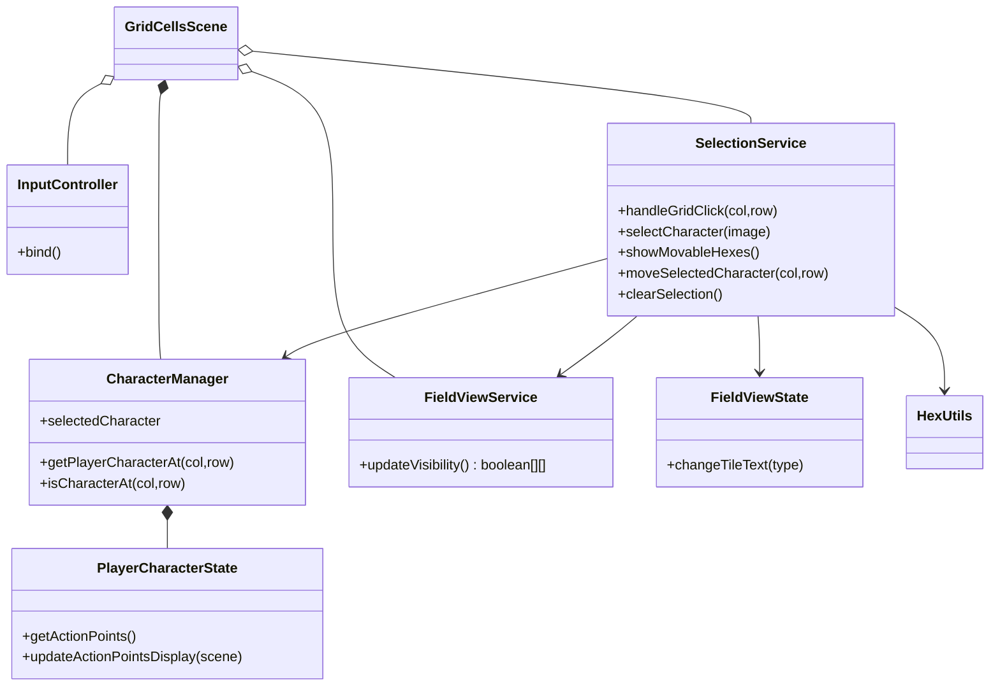
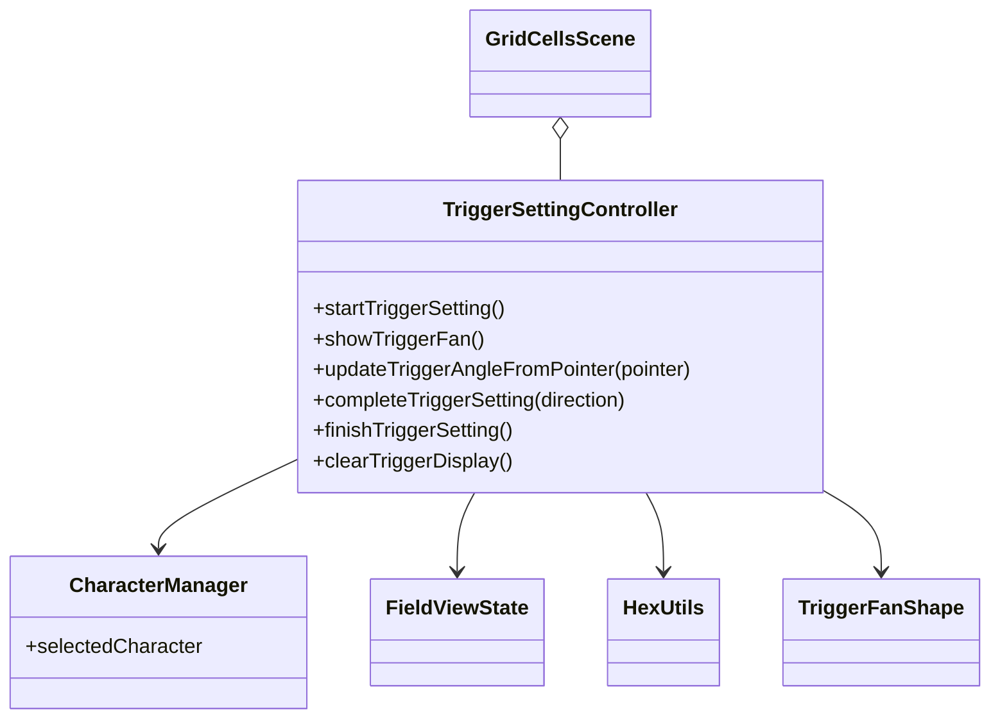
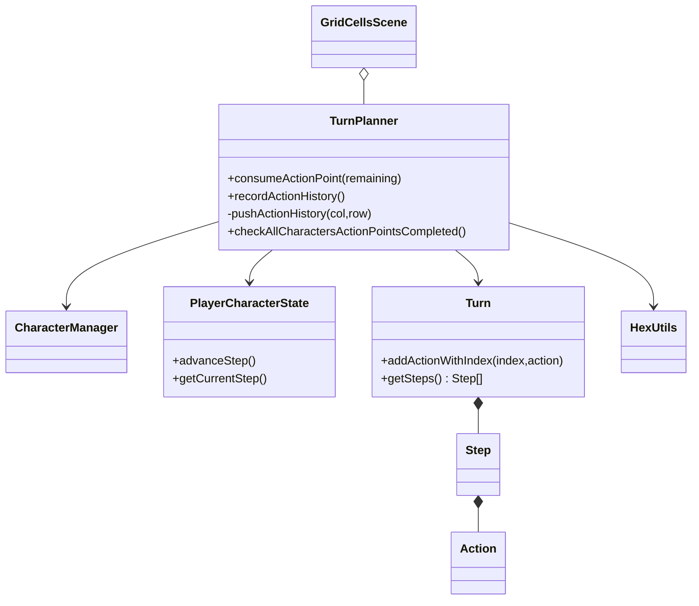
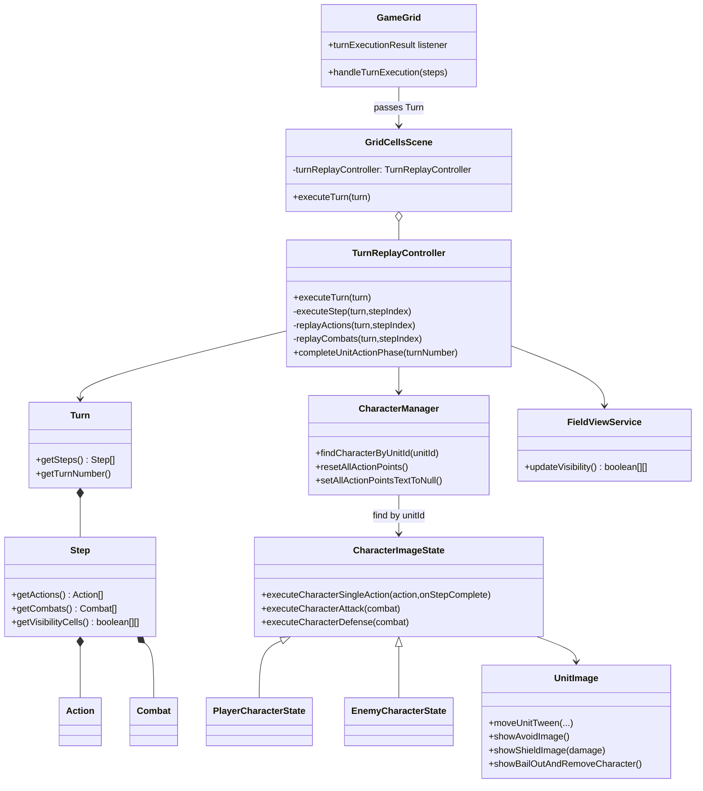

# フロント ゲーム関連クラス図

## 1. キャラクターの移動とトリガーの向き設定

### 1-1. 入力と移動（キャラ選択から移動まで）

#### 1-1 クラス解説

| クラス | 役割 |
| --- | --- |
| InputController | クリック/ドラッグを判定し、Scene へ入力イベントを委譲する。 |
| SelectionService | 選択・移動先判定・移動実行・選択解除の責務を持つ。 |
| CharacterManager | 選択中キャラとマス上のキャラ探索 API を提供する。 |
| PlayerCharacterState | 単体キャラの AP と位置表示の状態を保持する。 |
| FieldViewService | 移動後の視界を再計算する。 |
| FieldViewState | マス表示（座標/高さ）と可視表示の切り替え先。 |

#### 1-1 主要メソッド解説

| クラス.メソッド | 解説 |
| --- | --- |
| SelectionService.handleGridClick | クリック先を「選択」「移動」「解除」に分岐する。 |
| SelectionService.showMovableHexes | 選択キャラの AP から移動可能セルを描画する。 |
| SelectionService.moveSelectedCharacter | キャラ位置と表示を更新し、視界更新を呼ぶ。 |
| SelectionService.clearSelection | 選択状態とハイライトをリセットする。 |
| FieldViewService.updateVisibility | 現在の味方配置で可視マップを更新する。 |

### 1-2. トリガー向き設定（main/sub の角度確定）

#### 1-2 クラス解説

| クラス | 役割 |
| --- | --- |
| TriggerSettingController | main/sub の角度入力、扇形表示、確定フロー制御を担当する。 |
| TriggerFanShape | 現在角度の可視化（射程扇形）を描画する。 |
| CharacterManager | 角度設定対象の選択キャラを提供する。 |

#### 1-2 主要メソッド解説

| クラス.メソッド | 解説 |
| --- | --- |
| TriggerSettingController.startTriggerSetting | 移動後にトリガー設定モードへ遷移する。 |
| TriggerSettingController.showTriggerFan | 現在設定中トリガーの扇形と射程点を描画する。 |
| TriggerSettingController.updateTriggerAngleFromPointer | ドラッグ位置から角度を計算し再描画する。 |
| TriggerSettingController.completeTriggerSetting | main または sub を確定し、次フェーズへ進める。 |
| TriggerSettingController.finishTriggerSetting | 角度設定完了後、履歴記録と選択状態更新を行う。 |

### 1-3. 行動履歴の作成と送信判定

#### 1-3 クラス解説

| クラス | 役割 |
| --- | --- |
| TurnPlanner | AP消費、経路の Action 化、Turn への格納、送信タイミング判定を担当する。 |
| Turn / Step / Action | クライアントで構築するターン計画のデータ構造。 |
| PlayerCharacterState | 現在ステップ番号を持ち、Action の格納先を決める。 |

#### 1-3 主要メソッド解説

| クラス.メソッド | 解説 |
| --- | --- |
| TurnPlanner.consumeActionPoint | 行動後の AP を減らして表示を更新する。 |
| TurnPlanner.recordActionHistory | 移動経路と向き情報から Action 群を作る。 |
| TurnPlanner.pushActionHistory | 1マス分の Action を Step に追加する。 |
| TurnPlanner.checkAllCharactersActionPointsCompleted | 全員 AP=0 なら `turn.getSteps()` を送信する。 |

## 2. サーバーから結果を受け取ってユニットの行動

### 2-1. クラス解説

| クラス | 役割 |
| --- | --- |
| GameGrid | WebSocket の `turnExecutionResult` を受信し、`Turn` を Scene に渡す。 |
| GridCellsScene | 受信ターンを `TurnReplayController` に委譲して再生を開始する。 |
| TurnReplayController | Step を順番に再生し、Action/Combat の演出実行と完了処理を担当する。 |
| CharacterManager | unitId から対象キャラを解決し、再生中の更新対象を提供する。 |
| CharacterImageState | 単体キャラの移動・攻撃・防御演出を実行する基底クラス。 |
| PlayerCharacterState / EnemyCharacterState | 味方/敵で再生時の座標変換や表示差分を吸収する。 |
| UnitImage | Tween と被弾/回避/ベイルアウトなどの見た目演出を持つ。 |
| Turn / Step / Action / Combat | サーバー結果のデータ構造。再生ロジックの入力。 |
| FieldViewService | 各ステップ再生後の視界更新を担当する。 |

### 2-2. 主要メソッド解説

| クラス.メソッド | 解説 |
| --- | --- |
| TurnReplayController.executeTurn | ターン再生のエントリポイント。先頭ステップから実行する。 |
| TurnReplayController.executeStep | 1ステップ分の Action/Combat/視界更新を行い、次ステップへ連鎖する。 |
| TurnReplayController.replayActions | Step 内 Action を unitId 解決して各キャラへ実行させる。 |
| TurnReplayController.replayCombats | Step 内 Combat を攻撃側/防御側キャラに反映する。 |
| TurnReplayController.completeUnitActionPhase | 再生完了後に AP と UI を初期化し、設定モードへ戻す。 |
| CharacterImageState.executeCharacterSingleAction | 1アクション分の移動・向き・表示更新を行う。 |
| CharacterImageState.executeCharacterAttack | 攻撃演出を描画する。 |
| CharacterImageState.executeCharacterDefense | 回避/シールド/ベイルアウト演出を適用する。 |
