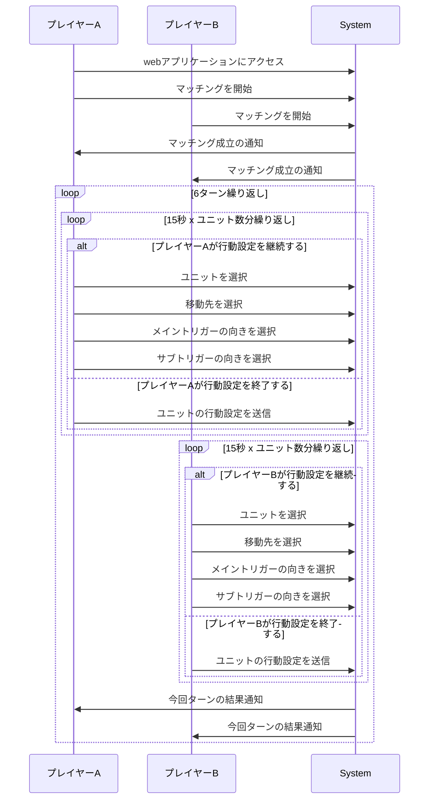

# イベントストーミング

## 参考

[イベントストーミング](https://zenn.dev/yamachan0625/books/ddd-hands-on/viewer/chapter5_event_storming)

イベントストーミング (Event Storming) とは、複雑なビジネスプロセスやドメインの知識を共有、可視化、そして理解するための協同作業ベースのモデリング手法です。

## 1. ドメインイベントの洗い出し

### 1-1. プレイヤー認証関連

* プレイヤーがwebアプリケーションにアクセスした

### 1-2. マッチング関連

* 一人目のプレイヤーがマッチングを開始した
* 二人目のプレイヤーがマッチングを開始した
* プレイヤー同士がマッチングした
* プレイヤーがマッチングをキャンセルした

### 1-3. 対戦関連

* プレイヤーがAIとの対戦を開始した
* プレイヤーが対戦を終了した

### 1-4. 行動設定関連

* プレイヤーがユニットを選択した
* プレイヤーが行動(移動)を設定した
* プレイヤーが移動先を選択した
* プレイヤーがトリガーを選択した
* プレイヤーがトリガーの向きを選択した
* プレイヤーが行動(追跡移動)を設定した
* プレイヤーが追跡対象のユニットを選択した
* プレイヤーがユニットの行動設定を送信した
* プレイヤーAがすべてのユニットのすべての行動を設定した
  * -> その後、プレイヤーBがすべてのユニットのすべての行動を設定した
  * -> プレイヤーBが行動の設定を提出せず150秒(+α)経過した
* 行動設定が完了する前に150秒経過した
* 6ターンが経過した

## 2. ドメインイベント同士を時系列で繋げる

systemはフロントエンドとバックエンドなどで分割しない。プレイヤーが主体としてどんな操作を行ったかを時系列で整理する。

## 3. ドメインイベント同士のギャップを埋める

### 3-1. コマンド

#### 3-1-1. プレイヤー認証関連

* プレイヤーがwebアプリケーションにアクセスする

#### 3-1-2. マッチング関連

* プレイヤーがマッチングを開始する
* プレイヤーがマッチングをキャンセルする

#### 3-1-3. 行動設定関連

* プレイヤーがユニットを選択する
* プレイヤーが移動先を設定する
* プレイヤーがメイントリガーの向きを選択する
* プレイヤーがサブトリガーの向きを選択する
* プレイヤーが対戦をキャンセルする
* プレイヤーがユニットの行動設定を送信する

### 3-2. ポリシー

* プレイヤー同士がマッチングしたら自動でゲームの初期化を開始する
  * マップを表示する
  * ユニットを配置する
  * ターンを1に設定する
  * 初期状態の視界をマップに反映する

* プレイヤーAが対戦をキャンセルしたら対戦を終了する
  * プレイヤーBに対戦キャンセルの通知を送る

* 両者のすべてのユニットの動きの設定が完了したらユニットの行動結果を計算する
* ユニットの行動結果の計算が完了したらそれぞれのプレイヤーに向けた内容の結果を通知する
* 動きの設定中に150秒が経過したら強制的に動きの設定を終了しユニットの行動結果を計算する
* 6ターンが経過したら対戦を終了する
