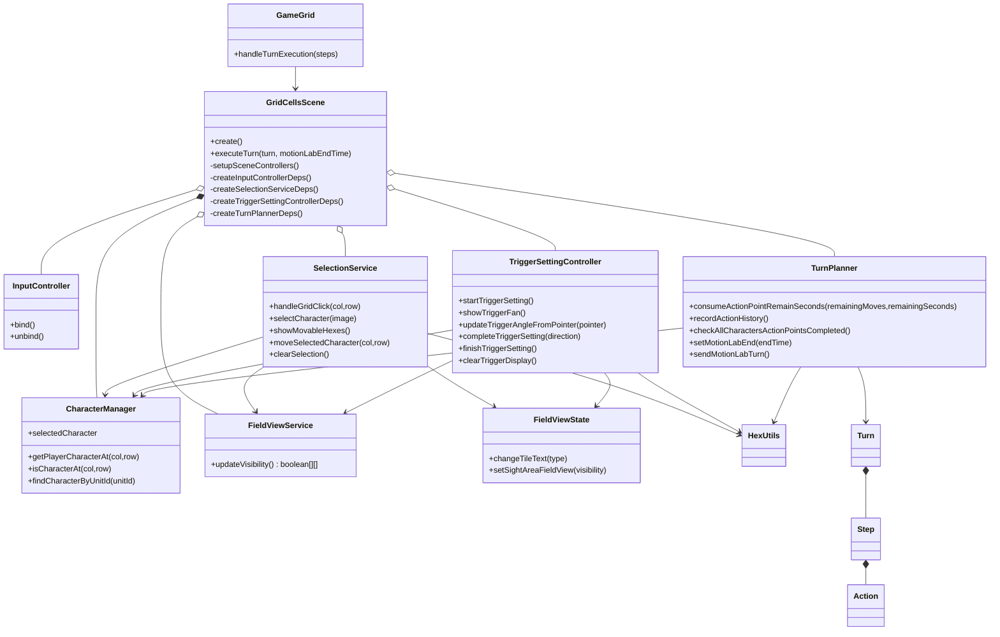
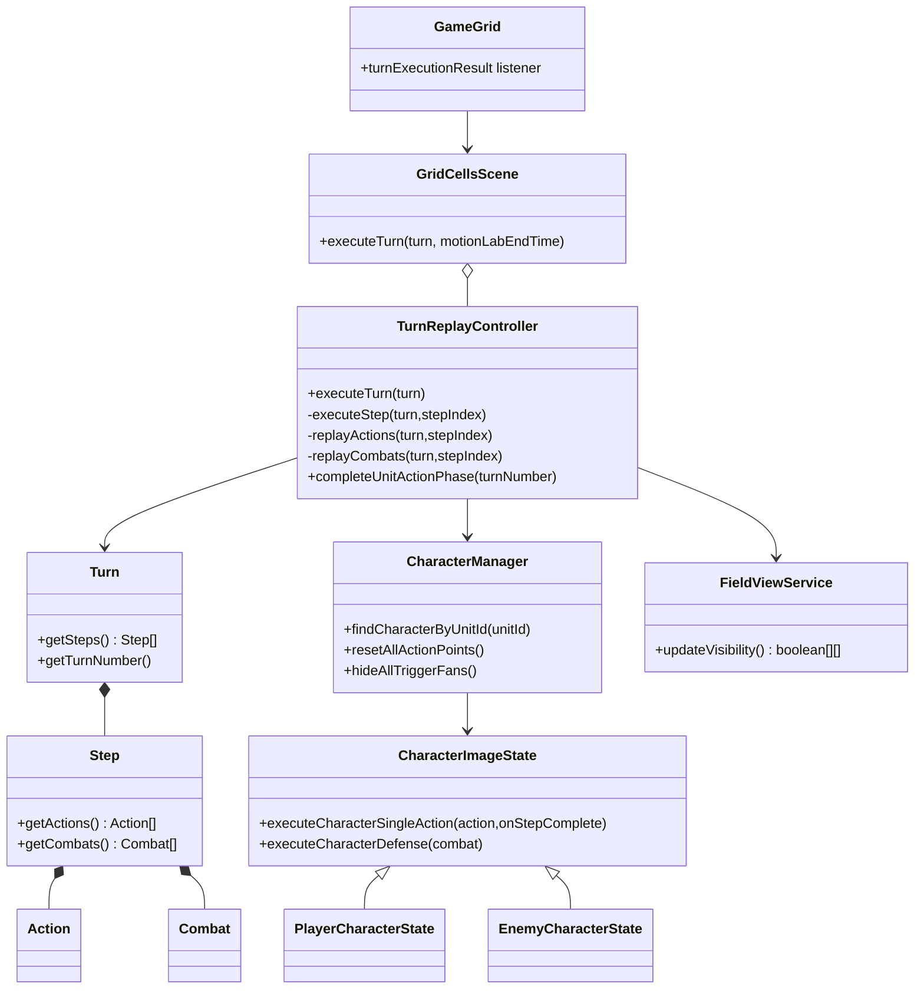

## 概要

本ドキュメントは、2D版フロントエンドのゲームロジッククラス構成を最新実装に合わせて整理したものです。

責務分離の要点は次のとおりです。

* Scene本体の責務を縮小し、入力、選択、トリガー設定、ターン計画、ターン再生を専用クラスへ分離
* `*Deps` インターフェースで依存を明示化し、段階的な置き換えとテスト容易性を向上
* 視界計算は `FieldViewService`、表示反映は `FieldViewState` で分離

## 行動設定フェーズ

### 入力、選択、トリガー設定、行動履歴

### クラス責務

| クラス | 役割 |
| --- | --- |
| `GridCellsScene` | 初期化と依存注入を担当し、入力やドメイン処理は委譲する。 |
| `InputController` | pointerイベントを一元管理し、Scene依存の処理呼び出しを抽象化する。 |
| `SelectionService` | 選択、移動候補表示、移動実行、選択解除を担当する。 |
| `TriggerSettingController` | main/subトリガー方位設定、扇形表示、設定確定フローを担当する。 |
| `TurnPlanner` | 残り秒数の消費、Action構築、未完了補完、送信判定を担当する。 |
| `FieldViewService` | 視界判定ロジックを担当し、結果を `FieldViewState` に反映する。 |

### 主要メソッド

| メソッド | 役割 |
| --- | --- |
| `SelectionService.handleGridClick` | キャラクター選択、移動、解除をクリック文脈で分岐する。 |
| `SelectionService.showMovableHexes` | 残り行動リソースから移動候補セルを再生成する。 |
| `TriggerSettingController.completeTriggerSetting` | main確定後にsubへ遷移し、sub確定で履歴記録へ進める。 |
| `TurnPlanner.recordActionHistory` | 直前位置と現在位置から経路を算出し、`Action` を `Turn` へ追加する。 |
| `TurnPlanner.checkAllCharactersActionPointsCompleted` | 全ユニット完了時に `turnExecution` 送信を実行する。 |

## 行動実行フェーズ

### サーバー受信ターンの再生

### クラス責務

| クラス | 役割 |
| --- | --- |
| `GameGrid` | `turnExecutionResult` を受信して `Turn` を Scene へ受け渡す。 |
| `TurnReplayController` | ステップ順再生、戦闘演出反映、終了判定、次フェーズ復帰を担当する。 |
| `CharacterManager` | 再生対象解決と、再生後の表示リソース復帰を担当する。 |
| `FieldViewService` | 各ステップ再生後の視界を再計算して表示へ反映する。 |

### 主要メソッド

| メソッド | 役割 |
| --- | --- |
| `TurnReplayController.executeTurn` | 再生開始前に選択状態を解除し、先頭ステップを実行する。 |
| `TurnReplayController.executeStep` | Action、Combat、視界更新を連鎖しながら次ステップへ進行する。 |
| `TurnReplayController.replayActions` | `unitId` で対象ユニットを解決し、移動アクションを実行する。 |
| `TurnReplayController.replayCombats` | 攻撃、防御、被弾反映をユニット状態へ適用する。 |
| `TurnReplayController.completeUnitActionPhase` | 再生完了後に行動リソースを復元し、次ターンへ遷移する。 |

## 補足

3D版の構成は別ドキュメントで管理します。

* `docs/03_詳細設計/クラス図/フロント_ゲーム関連クラス図_3Dモデル版.md`
