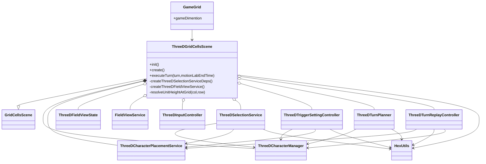
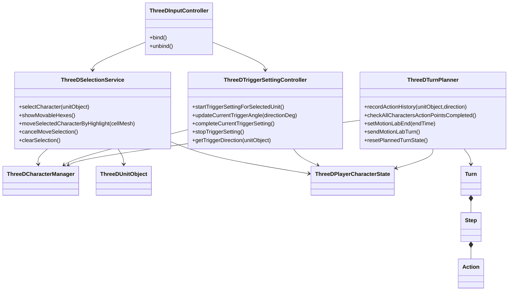
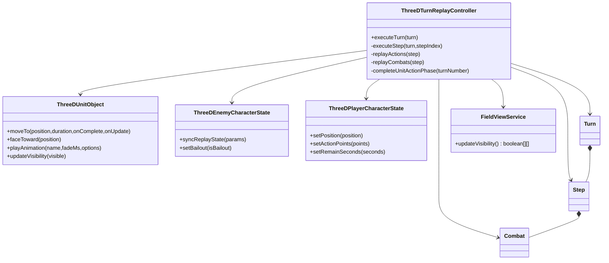

## 概要

本ドキュメントは、3D版フロントエンドのゲームロジッククラス構成を整理したものです。

3D版は `GridCellsScene` を継承しつつ、次の専用クラスで責務を分割しています。

* 3D入力は `ThreeDInputController`
* 選択と移動候補表示は `ThreeDSelectionService`
* トリガー方位設定は `ThreeDTriggerSettingController`
* 行動計画と送信判定は `ThreeDTurnPlanner`
* サーバー受信ターンの再生は `ThreeDTurnReplayController`

## 初期化と依存構成

### 3Dシーンの主要依存

### クラス責務

| クラス | 役割 |
| --- | --- |
| `ThreeDGridCellsScene` | 3D表示の初期化と、3D専用サービスの依存注入を担当する。 |
| `ThreeDFieldViewState` | 3D地形モデル、空、地面、光源、視界セル表示を管理する。 |
| `ThreeDCharacterManager` | 3Dユニット、ユニット座標、味方/敵状態の管理を担当する。 |
| `ThreeDCharacterPlacementService` | グリッド座標から3Dワールド座標への変換を担当する。 |
| `FieldViewService` | 2D版の視界計算ロジックを3D版でも再利用する。 |

## 行動設定フェーズ

### 選択、移動、トリガー設定、行動履歴

### 主要メソッド

| メソッド | 役割 |
| --- | --- |
| `ThreeDSelectionService.showMovableHexes` | 選択ユニットの残り行動リソースに基づき移動候補セルを再生成する。 |
| `ThreeDSelectionService.moveSelectedCharacterByHighlight` | セル選択から3D移動アニメーション、座標更新、視界更新までを処理する。 |
| `ThreeDTriggerSettingController.completeCurrentTriggerSetting` | main確定後にsubへ遷移し、sub確定で外部コールバックへ通知する。 |
| `ThreeDTurnPlanner.recordActionHistory` | 3Dユニットの移動履歴とトリガー方位を `Action` 群へ変換する。 |
| `ThreeDTurnPlanner.sendMotionLabTurn` | 未完了行動を補完して `turnExecution` を送信する。 |

## 行動実行フェーズ

### 受信ターンの3D再生

### クラス責務

| クラス | 役割 |
| --- | --- |
| `ThreeDTurnReplayController` | ステップ順再生、移動アニメーション、撃破反映、ゲーム終了判定、次フェーズ復帰を担当する。 |
| `ThreeDUnitObject` | 3Dモデル、移動、向き、アニメーション再生の表示責務を担当する。 |
| `ThreeDEnemyCharacterState` | 敵ユニットの表示座標同期と撃破状態の管理を担当する。 |
| `ThreeDPlayerCharacterState` | 味方ユニットの現在位置、残り行動リソース、ステップ進行を管理する。 |

## 補足

2D版のクラス図は次のドキュメントを参照してください。

* `docs/03_詳細設計/クラス図/フロント_ゲーム関連クラス図.md`
