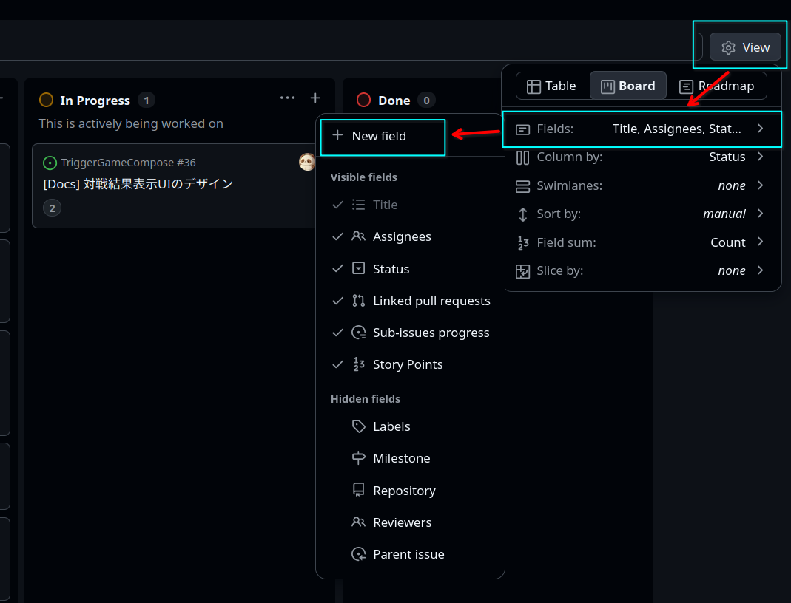

# GitHub関連資料

## マイルストーン(例: 202604sprint)の追加方法

1. [マイルストーンの一覧](https://github.com/pandapan-cute/TriggerGameCompose/milestones)を開く

2. 「New milestone」をクリック

3. Titleにマイルストーンの名前を入力 (例: 202604sprint)

4. Due dateにマイルストーンの期限を入力 (例: 2026-04-30)

5. Descriptionにマイルストーンの説明を入力 (例: 2026年4月のスプリント)

6. 「Create milestone」をクリックしてマイルストーンを作成

## チケットのフィールド追加方法

チケットに「story point」や「Actuals」を追加する方法について

